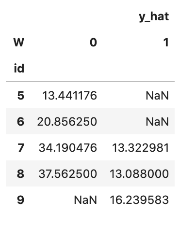
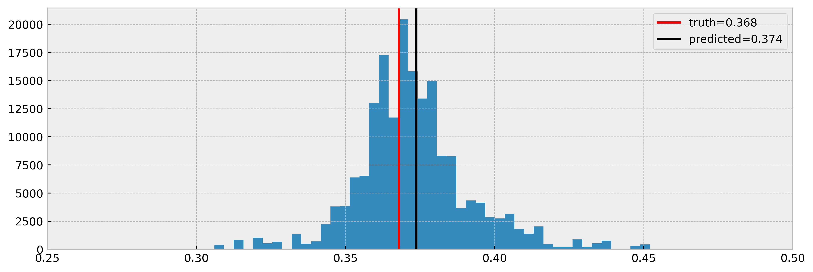
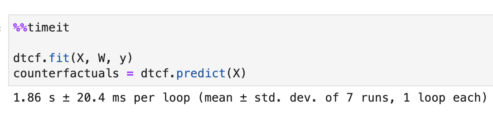
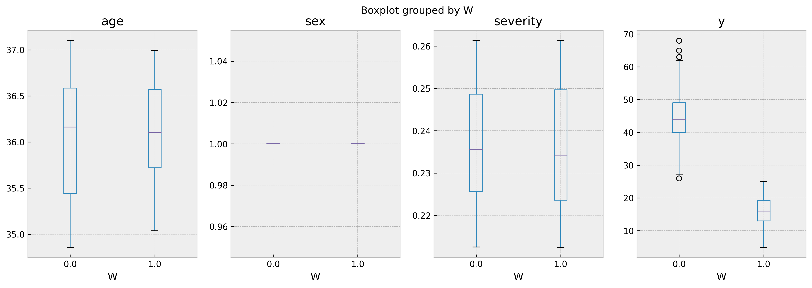
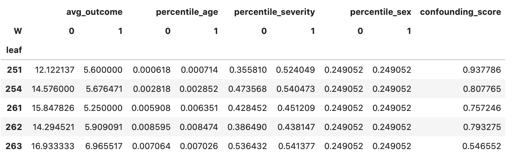
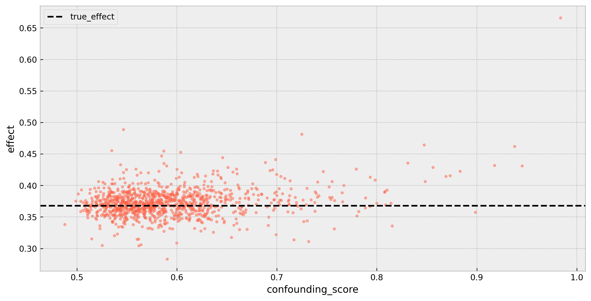
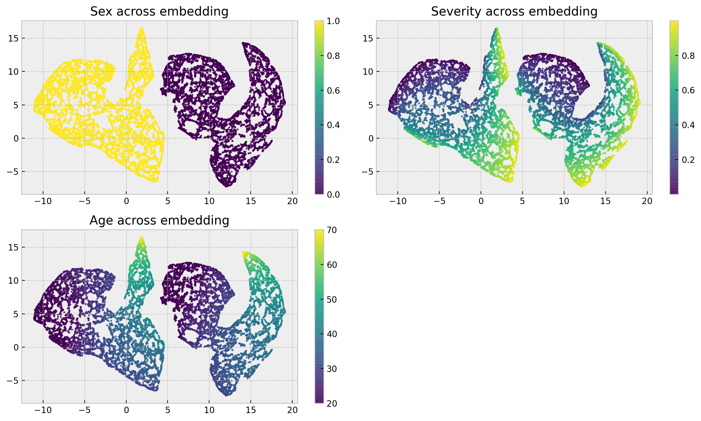
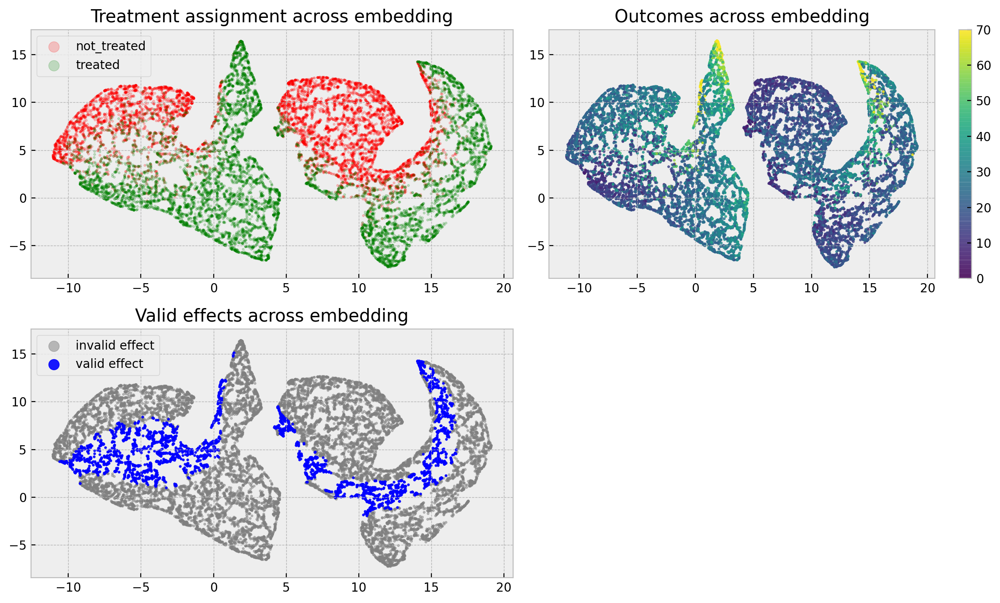

## cfml_tools: Counterfactual Machine Learning Tools
 
For a long time, ML practitioners and statisticians repeated the same mantra: *Correlation is not causation*. This warning prevented (at least, some) people from drawing wrong conclusions from models. However, it also created a misconception that models **cannot** be causal. With a few tweaks drawn from the causal inference literature ([DeepIV](http://proceedings.mlr.press/v70/hartford17a/hartford17a.pdf), [Generalized Random Forests](https://arxiv.org/pdf/1610.01271.pdf), [Causal Trees](https://arxiv.org/abs/1504.01132)) and Reinforcement Learning literature ([Bandits](https://arxiv.org/abs/1711.07077), [Thompson Sampling](https://web.stanford.edu/~bvr/pubs/TS_Tutorial.pdf)) we actually **can** make machine learning methods aware of causality!

**`cfml_tools`** is my collection of causal inference algorithms built on top of accessible, simple, out-of-the-box ML methods, aimed at being explainable and useful in the business context.

## Installation

Open up your terminal and perform:

```
git clone https://github.com/gdmarmerola/cfml_tools.git
cd cfml_tools
python setup.py install
```

## Basic Usage

Use the example dataset to test the package:

```python
from cfml_tools.utils import make_confounded_data

# compliments to nubank fklearn library
df_rnd, df_obs, df_cf = make_confounded_data(500000)

# organizing data into X, W and y
X = df_obs[['sex','age','severity']]
W = df_obs['medication'].astype(int)
y = df_obs['recovery']
```

 Our end result is to get counterfactual predictions. This is obtained by using the `.predict()` method, which returns a dataframe with the expected outcome for each treatment, when it is possible to calculate it. The package uses a scikit-learn like API, and is fairly easy to use.

```python
# importing cfml-tools
from cfml_tools.tree import DecisionTreeCounterfactual

# instance of DecisionTreeCounterfactual
dtcf = DecisionTreeCounterfactual(save_explanatory=True)

# fitting model to our data
dtcf.fit(X, W, y)

# predicting counterfactuals
counterfactuals = dtcf.predict(X)
counterfactuals.iloc[5:10]
```



`DecisionTreeCounterfactual`, in particular, builds a decision tree to solve a regression or classification problem from explanatory variables `X` to target `y`, and then compares outcomes for every treatment `W` at each leaf node to build counterfactual predictions. It yields great results on fklearn's [causal inference problem](https://fklearn.readthedocs.io/en/latest/examples/causal_inference.html) out-of-the-box. 



and it is very fast (500k records dataset):



## Additional features

### Run cross validation to get `X` to `y` prediction results

Check how the underlying model predicts the outcome, regardless of treatment (this should be as high as possible):

```python
cv_scores = dtcf.get_cross_val_scores(X, y)
print(cv_scores)
```

```
[0.55007156 0.54505553 0.54595812 0.55107778 0.5513648 ]
```

### Explain counterfactual predictions using leaves 

The `.explain()` method provides explanations by using the elements on the leaf node used to perform the counterfactual prediction.

```python
# sample we wish to explain
test_sample = X.iloc[[5000]]

# running explanation
comparables_table = dtcf.explain(test_sample)
comparables_table.groupby('W').head(2)
```

index | sex | age | severity | W | y
---- | ---- | ---- | ---- | ---- | ----
5000 | 1 | 36 | 0.23 | 0 | 52
5719 | 1 | 35 | 0.25 | 0 | 38
23189 | 1 | 37 | 0.22 | 1 | 13
35839 | 1 | 35 | 0.25 | 1 | 11

This way we can compare samples and check if we can rely on the effect being calculated. In this particular case, it seems that we can rely on the prediction, as we have very similar individuals on treated and untreated groups:

```python
fig, ax = plt.subplots(1, 4, figsize=(16, 5), dpi=150)
comparables_table.boxplot('age','W', ax=ax[0])
comparables_table.boxplot('sex','W', ax=ax[1])
comparables_table.boxplot('severity','W', ax=ax[2])
comparables_table.boxplot('y','W', ax=ax[3])
```




### [Experimental] Further criticize the model using leaf diagnostics

We can inspect the model further by using the `.run_leaf_diagnostics()` method.

```python
# running leaf diagnostics
leaf_diagnostics_df = dtcf.run_leaf_diagnostics()
leaf_diagnostics_df.head()
```



The method provides a diagnostic on leaves valid for counterfactual inference, showing some interesting quantities:
* average outcomes across treatments (`avg_outcome`) 
* explanatory variable distribution across treatments (`percentile_*` variables) 
* a confounding score for each variable, meaning how much we can predict the treatment from explanatory variables inside leaf nodes using a linear model (`confounding_score`)

Particularly, `confounding_score` tells us if treatments are not randomly assigned given explanatory variables, and it is a big source of bias in causal inference models. As this score gets bigger, we tend to miss the real effect more:




### [Experimental] Better visualize and understand your problem with forest embeddings

Besides `DecisionTreeCounterfactual`, we provide `ForestEmbeddingsCounterfactual`, which still is at an experimental phase. A cool thing to do with this model is plot the [forest embeddings](https://gdmarmerola.github.io/forest-embeddings/) of your problem. The method uses leaf co-occurence as similarity metric and UMAP for dimensionality reduction.

```python
# getting embedding from data
reduced_embed = fecf.get_umap_embedding(X)
```

This allows for some cool visuals for diagnosing your problem, such as the distribution of features across the embedding:



or how treatments and outcomes are distributed to check "where" inference is valid:



### Additional resouces

You can check several additional resources:

* [my article about Forest Embeddings Counterfactual](https://gdmarmerola.github.io/forest-embeddings-counterfactual/)
* [my article about Decision Tree Counterfactual](https://gdmarmerola.github.io/forest-embeddings-counterfactual/)
* [my article about confounding and leaf diagnostics]() 
* [Decision Tree Counterfactual example notebook](https://github.com/gdmarmerola/cfml_tools/blob/master/examples/Decision%20Tree%20Counterfactual.ipynb)
* [Forest Embeddings Counterfactual example notebook](https://github.com/gdmarmerola/cfml_tools/blob/master/examples/Forest%20Embeddings%20Counterfactual.ipynb)
* [Leaf diagnostics example notebook](https://github.com/gdmarmerola/cfml_tools/blob/master/examples/Diagnosing%20validity%20of%20causal%20effects%20on%20decision%20trees.ipynb)

I hope you'll use `cfml_tools` for your causal inference problems soon! All feedback is appreciated :)  

